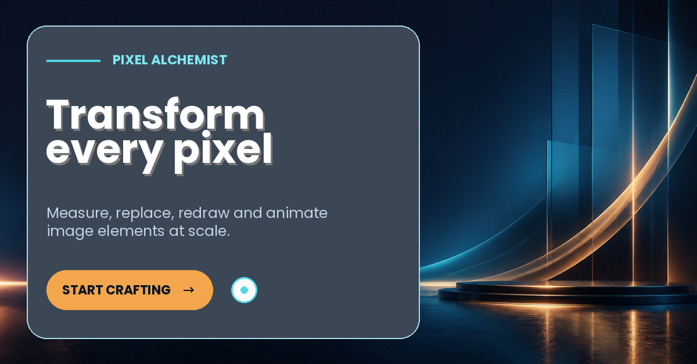
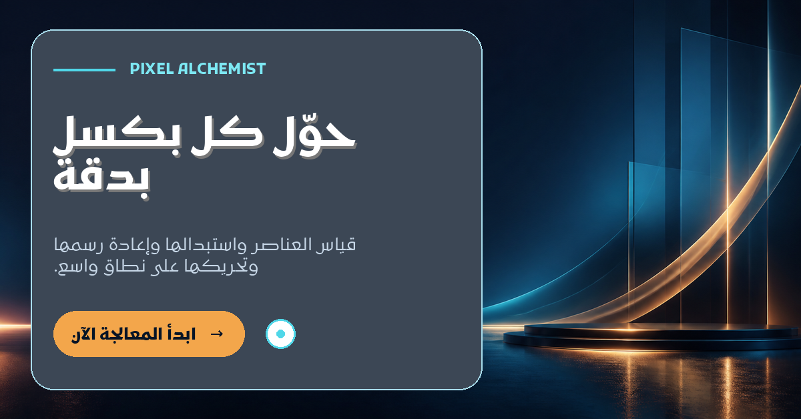
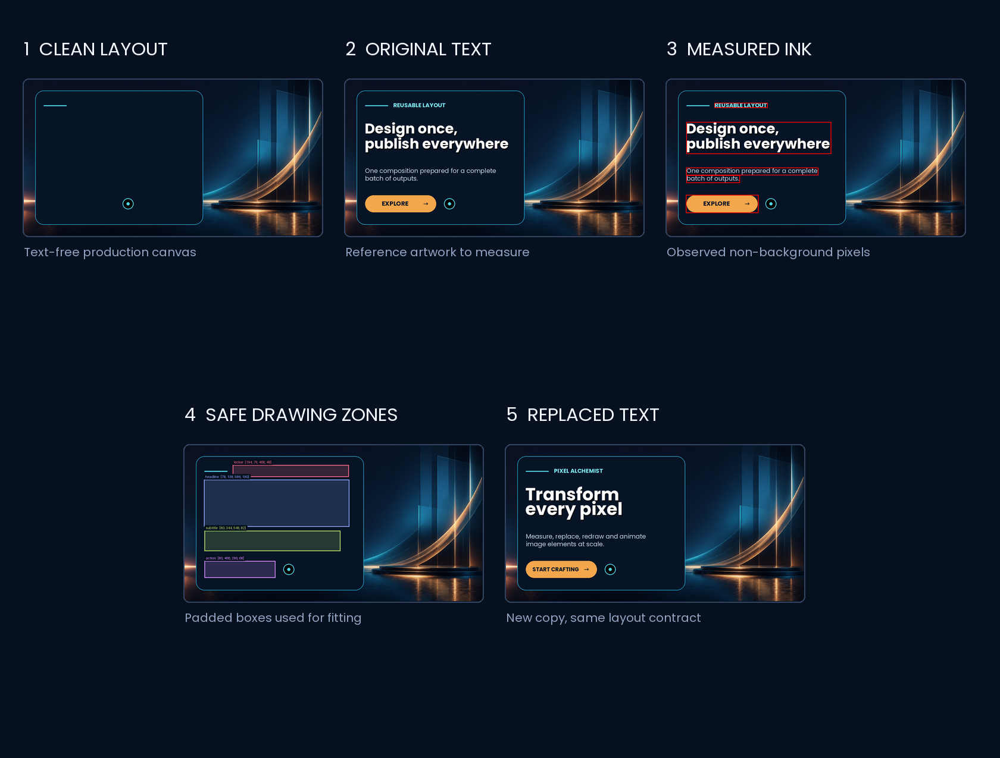
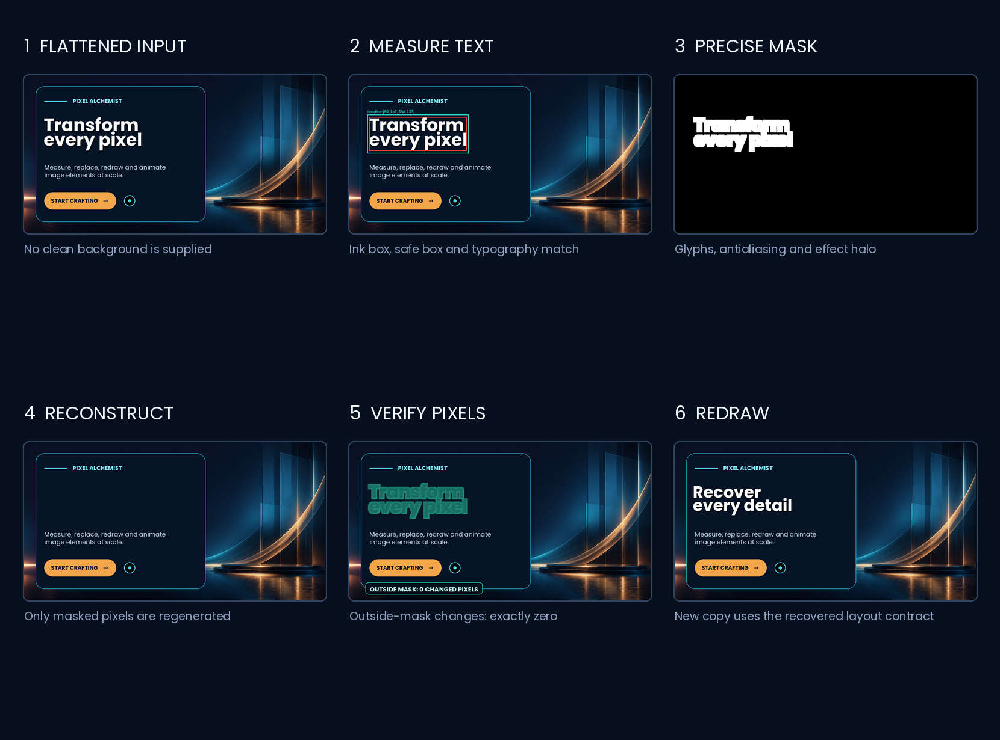

# Pixel Alchemist · 像素炼金术师

<p align="center">
  
</p>

Turn a folder of source images into a reproducible batch of edited static images and frame-accurate GIFs.

把一批原始图片变成可重复执行、可检查、可扩展的静态图与逐帧 GIF 成品。

Pixel Alchemist is a Codex skill and Python toolkit for measuring, removing, replacing, and drawing image elements at scale. It handles text, images, logos, icons, product cutouts, prices, dates, buttons, shapes, masks, multilingual layouts, and custom animation.

Pixel Alchemist 是一个用于批量测量、擦除、替换和绘制图片元素的 Codex Skill 与 Python 工具集。它可以处理文字、图片、标志、图标、商品、价格、日期、按钮、形状、遮罩、多语种排版与自定义动画。

## Rendered examples · 绘制示例

| English | Arabic / RTL |
| --- | --- |
|  |  |

The demo starts from a generated text-free background and renders English and Arabic variants through the same JSON specification. Source, configuration, outputs, and render report are available in [`examples/demo`](examples/demo).

演示从一张无文字背景开始，通过同一份 JSON 配置绘制英文和阿拉伯语版本。背景、配置、成品和绘制报告均位于 [`examples/demo`](examples/demo)。

## Highlights · 核心能力

- Measure changed regions between clean backgrounds and finished references, with annotated coordinate previews.
- Batch by arbitrary variants: language, product, market, date, price, channel, or any combination.
- Measure every landscape, portrait, square, banner, and animation template as an independent coordinate system.
- Fit multilingual text with explicit semantic line breaks, grapheme-safe wrapping, font fallback, stroke, shadow, and RTL shaping.
- Separate logical text direction from physical canvas alignment for mixed Arabic, Latin, numbers, and punctuation.
- Align related elements inside one template with shared-edge groups while retaining template-specific coordinates.
- Replace images with variant-aware fallbacks, `contain`/`cover`/`stretch`, opacity, and rotation.
- Draw buttons, rectangles, ellipses, polygons, lines, and measured icon-text groups.
- Remove flattened elements with solid fill, blur, masks, or OpenCV inpainting.
- Preserve GIF frame count, per-frame timing, disposal, transparency, and loop.
- Extend complex projects through frame hooks without forking the generic renderer.
- Validate output coverage, dimensions, fonts, alignment, spacing, overlap, readable size, and animation metadata; generate one QA grid per template.

## Repository layout · 目录结构

```text
pixel-alchemist/
├── SKILL.md
├── README.md
├── requirements.txt
├── agents/openai.yaml
├── scripts/
│   ├── inventory_assets.py
│   ├── measure_reference_diff.py
│   ├── analyze_flattened_text.py
│   ├── erase_text_mask.py
│   ├── visualize_layout.py
│   ├── check_text_runtime.py
│   ├── render_batch.py
│   └── validate_outputs.py
├── references/
│   ├── config-schema.md
│   ├── flattened-recovery.md
│   ├── typography-and-qa.md
│   └── bundled-fonts.md
├── examples/
│   ├── demo/
│   ├── process/
│   └── flattened-recovery/
└── assets/
    ├── icon.png
    ├── font-presets.json
    └── fonts/
```

## Install as a Codex skill · 安装为 Codex Skill

Clone or copy the folder into your personal skills directory:

```powershell
git clone https://github.com/ad-naan/Pixel-Alchemist.git "$env:USERPROFILE\.codex\skills\pixel-alchemist"
```

Then invoke it in Codex:

```text
Use $pixel-alchemist to inspect these source images, measure every replaceable element,
and render all requested variants into a clean output directory.
```

## Python environment · Python 环境

```powershell
python -m venv .venv
.\.venv\Scripts\Activate.ps1
python -m pip install -r requirements.txt
python scripts\check_text_runtime.py --config assets\font-presets.json
```

Arabic and other bidirectional text require Pillow with RAQM, FriBiDi, and HarfBuzz support. SVG rendering uses the precompiled `resvg` backend. Run the runtime checker before production. The renderer fails explicitly instead of silently producing broken shaping.

阿拉伯语及双向文字需要 Pillow 的 RAQM、FriBiDi 和 HarfBuzz 支持。正式绘制前必须运行环境检查；环境不完整时脚本会明确报错，不会跳过或生成错误连写。

## Quick workflow · 快速流程

1. Inventory the project:

   ```powershell
   python scripts\inventory_assets.py path\to\sources --output work\inventory.json
   ```

2. Measure finished artwork against clean backgrounds:

   ```powershell
   python scripts\measure_reference_diff.py path\to\clean path\to\finished `
     --output work\measurements.json --preview-dir work\previews
   ```

3. Create a batch JSON using [`references/config-schema.md`](references/config-schema.md).

4. Render selected variants:

   ```powershell
   python scripts\render_batch.py batch.json `
     --background-dir path\to\backgrounds `
     --output-dir output `
     --variants variant-a variant-b
   ```

5. Validate outputs:

   ```powershell
   python scripts\validate_outputs.py batch.json output `
     --json-output work\validation-report.json

   python scripts\build_qa_grid.py batch.json output `
     --qa-dir work\qa --validation-report work\validation-report.json
   ```

Every variant is written into its own folder. `render-report.json` records chosen font sizes, line breaks, actual ink and group bounds, applied overrides, and animation metadata. The QA directory contains a labeled comparison grid for each template.

## Text measurement and replacement workflow · 文字测量与改字流程



[`examples/process`](examples/process) is a reproducible five-stage example rather than a finished-image-only showcase:

1. Start with the clean production canvas.
2. Render or collect the reference artwork containing the original copy.
3. Compare the two images to measure the actual changed pixels. The result is stored in [`measurements.json`](examples/process/measurements.json) and shown as tight red ink bounds.
4. Convert the observed bounds into padded layout boxes. [`04-safe-zones.json`](examples/process/04-safe-zones.json) records the usable coordinates, while the preview makes overlaps and undersized boxes visible before batch rendering.
5. Render replacement copy through the same layout contract. Text fitting may reduce font size or wrap inside the safe box, but it cannot silently cross that box.

这个样例展示的不是单纯的前后对比，而是从“看见文字”到“得到可批处理坐标”的完整过程：差分测量得到紧贴字形的实际像素范围，再结合设计留白扩展为安全绘制区域，最后使用相同配置替换文案。样例中的四个安全区域为：`kicker [194,79,468,48]`、`headline [78,138,586,190]`、`subtitle [80,344,548,82]`、`action [80,466,286,68]`。

Rebuild the measurements and safe-zone preview with:

```powershell
python scripts\measure_reference_diff.py `
  examples\process\01-clean-layout.png `
  examples\process\02-before-text.png `
  --output examples\process\measurements.json `
  --preview-dir work\measurement-preview

python scripts\visualize_layout.py examples\process\batch.json `
  --background-dir examples\process `
  --template hero --variant before `
  --image examples\process\01-clean-layout.png `
  --roles kicker headline subtitle action `
  --output examples\process\04-safe-zones.png

python examples\process\build_board.py
```

The measured ink box is evidence; the safe box is a layout decision. Keep both artifacts so future changes can be audited instead of relying on visual guesswork.

## Finished-image-only recovery · 只有成品图时恢复文字层



[`examples/flattened-recovery`](examples/flattened-recovery) starts with one flattened finished image. No clean background is passed to the analysis or reconstruction commands. The workflow:

1. Segments the actual glyph pixels inside a bounded search region.
2. Measures the ink box, safe box, line geometry, alignment, fill color, and ranked font candidates.
3. Expands the precise glyph mask to include antialiasing and effects without replacing it with a rectangle.
4. Evaluates multiple reconstruction methods and changes only pixels inside that mask.
5. Verifies that the number of changed pixels outside the mask is exactly zero.
6. Draws replacement copy using the recovered font, weight, size, coordinates, and line-height contract.

In this sample, the analyzer identifies `Poppins Bold` at approximately `69px` from an original `70px` render. [`erase-report.json`](examples/flattened-recovery/erase-report.json) records `outside_mask_byte_identical: true`. The optional clean image used during automated testing is QA ground truth only and is never read by the recovery algorithm.

```powershell
python scripts\analyze_flattened_text.py `
  examples\flattened-recovery\01-finished-only.png `
  examples\flattened-recovery\analysis-spec.json `
  --output-dir work\flattened-analysis

python scripts\erase_text_mask.py `
  examples\flattened-recovery\01-finished-only.png `
  work\flattened-analysis\combined-erase-mask.png `
  --output work\cleaned.png --method auto
```

No algorithm can prove the original value of pixels hidden by flattened text when no clean source exists. Pixel Alchemist therefore makes the enforceable guarantee: pixels outside the approved mask remain byte-for-byte unchanged, while pixels inside it are reconstructed and scored for boundary continuity.

## Configuration model · 配置模型

A template describes one canvas, its independently measured coordinates, background, ordered elements, alignment groups, and QA rules. A variant supplies values, language, assets, background overrides, and narrow exceptions scoped to a named template.

模板负责自身画布尺寸、独立坐标、背景、元素顺序、对齐组和 QA 规则；变体负责文字数据、语种、图片资产、背景覆盖与指定模板内的局部修正。同名元素在横版与竖版中只代表相同语义，不代表相同坐标或等比例位置。

```json
{
  "font_preset": "@skill/assets/font-presets.json",
  "templates": {
    "landscape": {
      "canvas": [1600, 900],
      "background": "landscape.png",
      "output": "landscape.png",
      "elements": {
        "headline": {
          "type": "text",
          "value_key": "headline",
          "box": [84, 470, 620, 150],
          "max_font_size": 68,
          "min_font_size": 34,
          "max_lines": 3,
          "weight": "bold",
          "direction": "auto",
          "physical_align": "left",
          "wrap_strategy": "auto",
          "color": "#FFFFFF"
        },
        "date": {
          "type": "text",
          "value_key": "date",
          "box": [84, 628, 500, 54],
          "max_font_size": 42,
          "min_font_size": 28,
          "max_lines": 1
        }
      },
      "alignment_groups": {
        "main-copy": {
          "members": ["headline", "date"],
          "edge": "left",
          "anchor_role": "headline"
        }
      },
      "qa": {
        "alignment_groups": [{"roles": ["headline", "date"], "edge": "left", "metric": "ink_box", "tolerance": 2}],
        "spacing": [{"roles": ["headline", "date"], "axis": "y", "min": 12}],
        "elements": {"headline": {"min_font_size": 34, "max_lines": 3}}
      }
    },
    "portrait": {
      "canvas": [1080, 1350],
      "background": "portrait.png",
      "output": "portrait.png",
      "elements": {
        "headline": {"type": "text", "value_key": "headline", "box": [594, 336, 414, 150], "max_font_size": 56, "min_font_size": 32, "max_lines": 3},
        "date": {"type": "text", "value_key": "date", "box": [594, 500, 380, 52], "max_font_size": 38, "min_font_size": 26, "max_lines": 1}
      },
      "alignment_groups": {
        "main-copy": {"members": ["headline", "date"], "edge": "left", "position": 594}
      }
    }
  },
  "variants": [
    {"id": "en", "language": "en", "values": {"headline": "Four days until the city innovation forum", "date": "23–24 July 2026"}},
    {
      "id": "ar",
      "language": "ar",
      "values": {"headline": "تبقّى 4 أيام حتى Hall A في 2026", "date": "23–24 يوليو 2026"},
      "layout_overrides": {"portrait": {"headline": {"physical_align": "left"}}},
      "alignment_overrides": {"portrait": {"main-copy": {"position": 594}}}
    }
  ]
}
```

`direction` controls shaping and reading order. `physical_align` controls the visible canvas edge. They are intentionally independent: an Arabic paragraph containing a Latin event name and numbers may remain RTL while the complete block is physically left-aligned. Thai and similar scripts wrap at language segments or grapheme clusters so combining marks are never detached.

Placement groups are local to one template. Each entry in the `template.alignment_groups` object uses `edge: left|right|center` plus exactly one of `anchor_role` or `position`. The separate `template.qa.alignment_groups` list asserts alignment over rendered metrics with `roles`, `edge`, `metric`, and `tolerance`; it never moves content. Use `layout_overrides[template][element]` and `alignment_overrides[template][group]` only for the affected variant and template.

## Batch QA grids · 批量质检总览

Generate one stable, labeled comparison grid per template after validation. Review the longest copy, smallest selected font, mixed RTL/LTR content, Thai or another grapheme-sensitive language, fallback fonts/assets, and every applied override. Automated QA should reject configured alignment, spacing, non-overlap, safe-area, minimum-font, size, and animation violations before the grid reaches human review.

每个模板都应生成独立的全语种 QA 总览图。横版通过不代表竖版通过；自动检查负责拦截对齐、间距、碰撞、安全区、最小字号、尺寸和动画元数据问题，总览图用于快速发现视觉密度、断行平衡和字体观感等人工判断问题。

## Complex scenes · 复杂场景

Use built-in elements for deterministic layout. For OCR-assisted masks, advanced retouching, clipping paths, perspective transforms, mesh warps, generated QR/barcodes, blend modes, or coordinated animation, pass a small project hook:

```python
def before_frame(canvas, context):
    pass

def draw_element(canvas, role, spec, context):
    if spec["type"] != "custom_effect":
        return None
    # Draw the project-specific effect and return audit metrics.
    return {"handled": True, "frame": context["frame_index"]}

def after_frame(canvas, context):
    pass
```

```powershell
python scripts\render_batch.py batch.json --background-dir backgrounds `
  --output-dir output --hook project_hook.py
```

## Test · 测试

```powershell
python -m unittest discover -s tests
```

The tests cover arbitrary variants, independent template coordinates, template-local alignment groups, mixed RTL/LTR physical alignment, grapheme-safe Thai wrapping, icon-text grouping, layout QA, element removal, shapes, image assets, fitted text, safe-zone visualization, flattened-image font measurement, mask-scoped reconstruction, output validation, QA grids, and strict GIF metadata preservation.

## Fonts and licensing · 字体与授权

The repository includes common multilingual fonts only when their redistribution notices are bundled with the files. See [`references/bundled-fonts.md`](references/bundled-fonts.md).

Fonts whose files cannot be redistributed are not committed. The font reference links users to official download sources and shows how to configure local paths. Third-party fonts keep their own licenses. The Python source code also needs a repository license chosen by the repository owner before public release.

仓库只包含附有再分发许可文本的常用字体；不能直接分发的字体不上传，并在字体说明中引导用户从官方来源自行下载和配置。代码仓库采用何种开源许可证应由仓库所有者决定。
